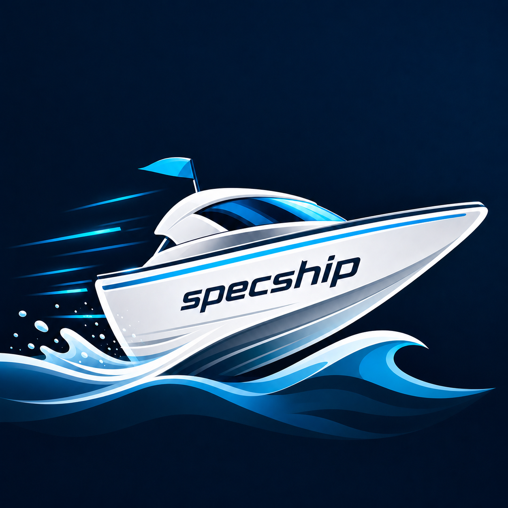
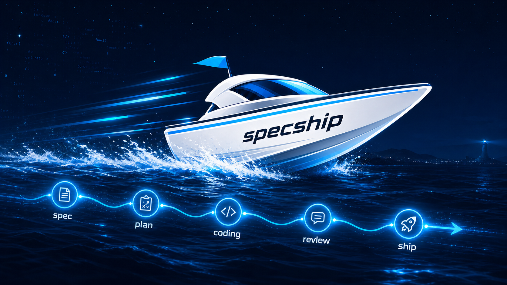

<p align="center">
  
</p>

<h1 align="center">specship</h1>

<p align="center">
  A staged <strong>spec → plan → coding → review</strong> workflow for shipping AI-assisted code with durable handoffs.
</p>

<p align="center">
  <a href="https://www.npmjs.com/package/specship"></a>
  
  
</p>

<p align="center">
  
</p>

## Why specship

specship installs a repeatable agent workflow into any project. One command drops
in the skill playbooks and writes the right config file at each AI coding
agent's native location.

| What you get | Why it matters |
| --- | --- |
| **Staged work** | Requirements, plans, code, and review each get their own explicit checkpoint. |
| **Disk-backed state** | Any agent or human can resume from `tasks/TASK-<ID>/` without relying on chat history. |
| **Native agent setup** | Claude Code, Codex, Cursor, and Antigravity receive their files in the paths they already expect. |
| **Reviewable artifacts** | Specs, plans, bug logs, and review notes stay in the repo as durable project context. |

## Quick Start

```bash
npx specship init --claude        # Claude Code
npx specship init --codex         # Codex
npx specship init --cursor        # Cursor
npx specship init --all           # all of the above (+ Antigravity)
```

After installing:

1. Map the codebase once with `/explore-source`.
2. Start a task with `/spec <ticket or feature request>`.
3. Approve each checkpoint as the task flows through `plan → coding → review`.

Use `ship` when you want the whole pipeline to run from one request:

```bash
/ship implement login
```

## Workflow

```text
explore-source ──▶ docs/onboarding/*        (one-time: learn the codebase)
                        │  read by every stage
                        ▼
spec ──▶ plan ──▶ coding ──▶ review ──▶ done
                   ▲           │
                   └─ debug ◀──┘           (attaches whenever a bug appears)
```

Every task lives in its own folder:

```text
tasks/
├── LESSONS.md       # project-wide process lessons (L#), read by every stage
└── TASK-001/
    ├── task.md      # SHARED STATE — stage, status, pipeline log
    ├── spec.md      # requirements (R#), acceptance criteria (AC#)
    ├── plan.md      # ordered steps (S#), each tracing to R#/AC#
    ├── review.md    # gate results, AC verification, commit/PR draft
    └── debug.md     # chronological bug log (BUG#)
```

Because state is on disk, not hidden in a chat session, any agent or human can
pick up a task exactly where the last one left off.

## Stages

| Stage | Output | Done when |
| --- | --- | --- |
| `explore-source` | `docs/onboarding/{source-structure, how-to-code, what-is-stack, how-to-deploy}.md` | The codebase map exists and can be read by every later stage. |
| `spec` | `tasks/TASK-<ID>/task.md` + `spec.md` | Requirements, acceptance criteria, boundaries, and open questions are `confirmed`. |
| `plan` | `plan.md` | Ordered steps trace back to `R#`/`AC#` and each step has a verify check. |
| `coding` | Code changes + checked-off `S#` items | Each planned step is implemented minimally and verified. |
| `review` | `review.md` | The full gate passes, `AC#` items are verified, and a commit/PR draft is written. |
| `debug` | `debug.md` | A defect is reproduced, fixed minimally, and verified with regression coverage when possible. |
| `ship` | A complete task run | `spec → plan → coding → review` runs end to end, stopping only on blockers. |

### Checkpoints

Stages never auto-advance by default. At the end of each stage, the agent
updates shared state, summarizes, and asks before moving on:

```text
spec → "plan it?"
plan → "start coding?"
coding → "review it?"
```

Approving moves the task into the next stage. Declining stops with everything
saved on disk. Invoking `ship` grants that approval up front for one task, then
stops only on blocker questions, destructive actions, or review failures.

## Commands

| Command | What it does |
| --- | --- |
| `init <agents>` | Install the workflow for `--claude`, `--codex`, `--cursor`, `--antigravity`, or `--all`. |
| `update` | Refresh skills and config for whatever agents are already installed in the project. |
| `list` | Show which agents are installed here. |

Options:

| Option | Meaning |
| --- | --- |
| `--dir <path>` | Target project. Defaults to the current working directory. |
| `--force` | Overwrite modified skill files. By default, local edits are kept. |
| `-v`, `--version` | Print the CLI version. |
| `-h`, `--help` | Print help. |

```bash
npx specship update
npx specship list
```

## What `init` Installs

For each agent, `init` copies the skills to that agent's skills folder and
writes or merges its config pointer at the correct native path.

| Agent | Skills | Config | Mode |
| --- | --- | --- | --- |
| `--claude` | `.claude/skills/` | `CLAUDE.md` | merge |
| `--codex` | `.codex/skills/` | `AGENTS.md` | merge |
| `--cursor` | `.cursor/skills/` | `.cursor/rules/specship.mdc` | write |
| `--antigravity` | `.agent/skills/` | `.agent/rules/specship.md` | write |

`merge` inserts an idempotent `<!-- specship:start -->…<!-- specship:end -->`
block into your existing file. Re-running `init` updates that block without
duplicating it, and creates the file if absent.

`write` drops a standalone config file, such as a Cursor rule.

## Contract Rules

- **`task.md` is the source of truth.** Every skill reads it first and updates
  it last with stage, status, artifact status, and a timestamped Pipeline Log
  line.
- **IDs are stable and append-only.** `R#`, `AC#`, `S#`, and `BUG#` are never
  renumbered. Dropped items are struck through with a timestamp, not deleted.
- **Checkboxes are progress.** `coding` ticks `S#` in `plan.md`; `review` ticks
  `AC#` in `spec.md`. Unticked means not done.
- **Everything is timestamped.** Timestamps use `YYYY-MM-DD HH:MM +TZ`, taken
  from `date`, never guessed.
- **Edit in place, never fork.** Artifacts evolve via `updated:` and Change
  History lines. There is no `spec-v2.md`.
- **Upstream changes invalidate downstream work.** If `spec.md` changes after
  the plan exists, the plan or review may be stale and must be revisited.
- **Stage preconditions are enforced.** `plan` requires a `confirmed` spec,
  `coding` requires an `approved` plan, and `review` requires all `S#` items
  ticked.
- **The flow learns from its own mistakes.** Process errors become lessons in
  `tasks/LESSONS.md`, which every stage reads during hydration.

The full contract is in `skills/WORKFLOW.md`. Each stage playbook lives in
`skills/<stage>/SKILL.md`.

## Example

`examples/slugify-demo/` is a complete worked task for a `slugify()` utility.
It ran the full pipeline, including a real bug caught during coding,
root-caused and logged as `BUG1` in `debug.md`, then verified in review.

Read `examples/slugify-demo/tasks/TASK-001/*` to see every artifact in practice,
and `examples/slugify-demo/tasks/LESSONS.md` for process lessons recorded
against the contract.

## Package Layout

```text
skills/                 # canonical skill playbooks shipped to each agent
.claude/CLAUDE.md       # pointer template → installed as CLAUDE.md
.codex/AGENTS.md        # pointer template → installed as AGENTS.md
.cursor/WORKFLOW.mdc    # pointer template → installed as .cursor/rules/specship.mdc
.antigravity/rules.md   # pointer template → installed as .agent/rules/specship.md
bin/cli.js              # CLI entry
src/                    # CLI logic; targets.js holds source→dest mappings
examples/slugify-demo/  # complete worked task, not installed
```

To add or re-map an agent, edit `src/targets.js` and add its pointer template.
No other code changes are needed.
