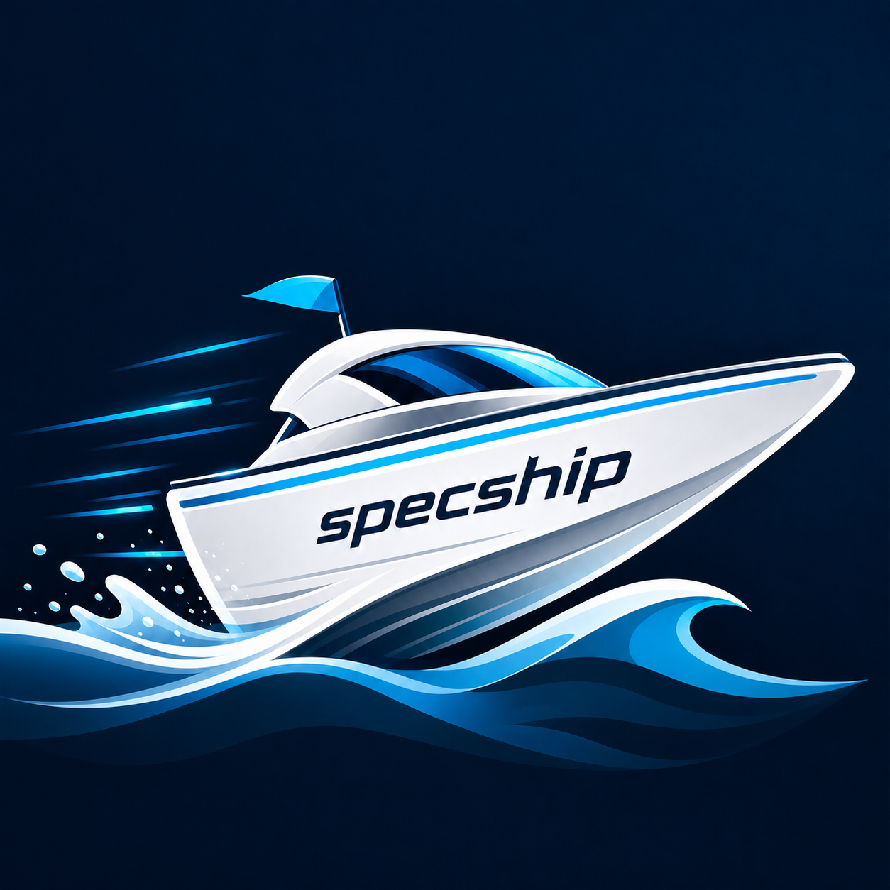
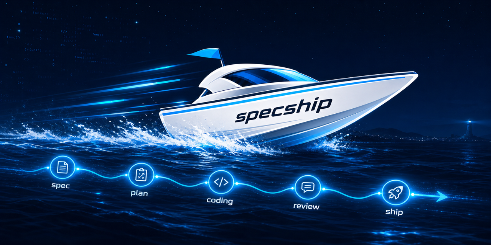

<p align="center">
  
</p>

<h1 align="center">specship</h1>

<p align="center">
  A staged <strong>spec → plan → coding → review</strong> workflow for shipping AI-assisted code with durable handoffs.
</p>

<p align="center">
  <a href="https://www.npmjs.com/package/specship"></a>
  <a href="https://www.npmjs.com/package/specship"></a>
  
  <a href="LICENSE"></a>
</p>

<p align="center">
  <a href="#quick-start">Quick Start</a> ·
  <a href="#workflow">Workflow</a> ·
  <a href="#commands">Commands</a> ·
  <a href="#contributing">Contributing</a> ·
  <a href="https://github.com/bonnguyenitc/specship/releases">Changelog</a>
</p>

<p align="center">
  
</p>

## Why specship

specship installs a repeatable agent workflow into any project. One command drops
in the skill playbooks and writes the right config file at each AI coding
agent's native location.

| What you get | Why it matters |
| --- | --- |
| **Staged work** | Requirements, plans, code, and review each get their own explicit checkpoint. |
| **Disk-backed state** | Any agent or human can resume from `tasks/TASK-<ID>/` without relying on chat history. |
| **Native agent setup** | Claude Code, Codex, Gemini CLI, Cursor, Antigravity, Copilot, Windsurf, Cline, Roo Code, and AGENTS.md-compatible agents receive files in the paths they already expect. |
| **Reviewable artifacts** | Specs, plans, bug logs, and review notes stay in the repo as durable project context. |

## Quick Start

Requires [Node.js](https://nodejs.org) >= 16.

```bash
npx specship init --claude        # Claude Code
npx specship init --codex         # Codex
npx specship init --agents        # AGENTS.md-compatible agents
npx specship init --gemini        # Gemini CLI
npx specship init --cursor        # Cursor
npx specship init --all           # every supported agent adapter
```

After installing:

1. Map the codebase once with `/explore-source`.
2. Start a task with `/spec <ticket or feature request>`.
3. Approve each checkpoint as the task flows through `plan → coding → review`.

Use `ship` when you want the whole pipeline to run from one request:

```bash
/ship implement login
```

Coming back later or setting work aside? `/resume-task` picks up where you left
off, `/pause-task` shelves a task as `paused`, and `/archive-task` moves a
finished one into `tasks/archive/` — see [Task lifecycle](#task-lifecycle).

## Workflow

```text
explore-source ──▶ docs/onboarding/*        (one-time: learn the codebase)
                        │  read by every stage
                        ▼
spec ──▶ plan ──▶ coding ──▶ review ──▶ done
                   ▲           │
                   └─ debug ◀──┘           (attaches whenever a bug appears)
```

Every task lives in its own folder:

```text
tasks/
├── LESSONS.md       # project-wide process lessons (L#), read by every stage
├── archive/         # shelved tasks (archive-task) — skipped by active scans
│   └── TASK-20260701-old-importer/   # a whole task folder moved here intact
└── TASK-20260723-fix-login/
    ├── task.md      # SHARED STATE — stage, status, pipeline log
    ├── spec.md      # requirements (R#), acceptance criteria (AC#)
    ├── plan.md      # ordered steps (S#), each tracing to R#/AC#
    ├── review.md    # gate results, AC verification, commit/PR draft
    └── debug.md     # chronological bug log (BUG#)
```

Task ids reuse an existing ticket key (`TASK-PROJ-123`) or are generated as
`TASK-<YYYYMMDD>-<slug>` (`TASK-20260723-fix-login`) — no shared counter, so
tasks started in parallel can never mint the same id; older numeric ids like
`TASK-001` stay valid.

Because state is on disk, not hidden in a chat session, any agent or human can
pick up a task exactly where the last one left off.

### Task lifecycle

A task has two independent axes:

- **`stage`** — *where the work is* in the pipeline: `spec → plan → coding → review → done`.
- **`status`** — *whether it's being worked on*: `active`, `blocked` (stuck on an
  external dependency), `paused` (deliberately shelved), or `done`.

The `status` axis moves like this (the `stage` axis is untouched throughout):

```text
                         pause-task
            ┌──────────────────────────────────▶ paused
  spec ──▶ active ◀──────────────────────────────┘
            │  ▲              resume-task
            │  │
   stage    │  │  dependency appears / clears
   skills   ▼  │
          blocked

  review approved:   active ──▶ done

  archive-task:   any status ─────────────▶  archived  (folder → tasks/archive/)
   active │ blocked │ paused │ done             │
                                                │  resume-task <ID>
                              active  ◀─────────┘  (move folder back + restore status)
```

- `active ↔ blocked` is set by the **stage skills** (a dependency appears /
  clears) — not a lifecycle action.
- `pause-task` / `resume-task` toggle `active ↔ paused`.
- `archive-task` moves **any** status into `archive/`; `resume-task <ID>` moves it
  back and re-activates it.

Three lifecycle skills move a task around the pipeline **without ever changing its
`stage` or artifacts** — they touch only `status` and location, and every
transition leaves a dated Pipeline Log line:

| Skill | Effect | Reverse |
| --- | --- | --- |
| `/resume-task [ID]` | Locate a task, reconstruct its state from disk, report where it stands, and resume the right stage. With no ID it picks the most recently updated **active** task (never an archived or `paused` one). | — (it's the entry point) |
| `/pause-task [ID]` | Mark a task `status: paused` with a reason, leaving it in place. It won't be mistaken for active work or auto-picked. | `/resume-task <ID>` flips it back to `active`. |
| `/archive-task [ID]` | Move a finished or abandoned task's folder into `tasks/archive/`, history intact, so active scans stay clean. Nothing is deleted. | `/resume-task <ID>` finds it in `archive/` and moves it back. |

Pipeline state is always preserved: pausing, archiving, and restoring never change
`stage` or any artifact — resuming continues exactly where the work stopped. A task
that was both paused **and** archived is fully re-activated on resume (moved out of
`archive/` *and* flipped back to `active`).

## Stages

| Stage | Output | Done when |
| --- | --- | --- |
| `explore-source` | `docs/onboarding/{source-structure, how-to-code, what-is-stack, how-to-deploy}.md` | The codebase map exists and can be read by every later stage. |
| `spec` | `tasks/TASK-<ID>/task.md` + `spec.md` | Requirements, acceptance criteria, boundaries, and open questions are `confirmed`. |
| `plan` | `plan.md` | Ordered steps trace back to `R#`/`AC#` and each step has a verify check. |
| `coding` | Code changes + checked-off `S#` items | Each planned step is implemented minimally and verified. |
| `review` | `review.md` | The full gate passes, `AC#` items are verified, and a commit/PR draft is written. |
| `debug` | `debug.md` | A defect is reproduced, fixed minimally, and verified with regression coverage when possible. |
| `ship` | A complete task run | `spec → plan → coding → review` runs end to end, stopping only on blockers. |
| `research` | A cited research summary (chat, or `docs/research/*.md` on request) | The question is answered from verified, dated sources using the strongest search tool available. |

`explore-source`, `ship`, and `research` are not stages: `explore-source` is a
one-time codebase mapping that every stage reads, `ship` is an orchestrator that
runs the four stages back to back, and `research` is a standalone helper that
answers external-fact questions (libraries, APIs, "latest X") — preferring a
specialized MCP search tool over generic web search — and never writes to `tasks/`.

### Per-stage models (Claude Code)

Each stage skill declares a `model:` in its SKILL.md frontmatter, so every phase runs on the model best suited to it.
The reasoning-heavy stages (`spec`, `plan`, `review`, `debug`) default to `opus`; `coding` defaults to `sonnet`; every other skill inherits the session model.
Claude Code switches to the declared model while the skill runs and returns to the session model afterwards.

Only Claude Code honors the field - Codex, Cursor, Gemini CLI, Antigravity, and the adapter agents ignore unknown frontmatter, so the same skill files work everywhere.
To change the mapping in your project, edit the `model:` line in the installed skill (e.g. `.claude/skills/coding/SKILL.md`) - aliases (`fable`, `opus`, `sonnet`, `haiku`), full model IDs, and `inherit` are accepted.
Note that `specship update` and `init --force` restore the shipped defaults.

If an external tool picks the model per phase, install with `--profile orchestrated` instead of hand-editing: the stage skills are then generated with `model: inherit` so the caller's choice wins, and `update` keeps it that way. See [External orchestration](#external-orchestration).

### Lifecycle skills

These manage a task's `status` and location around the pipeline — see
[Task lifecycle](#task-lifecycle) for the full picture. They never change `stage`
or artifacts.

| Skill | Output | Done when |
| --- | --- | --- |
| `resume-task` | Re-entry into an existing task | The task is located (un-shelved first if paused/archived), its state reconstructed from disk and reported, and the correct stage skill resumed. |
| `pause-task` | A task marked `paused` | The task is deliberately shelved with a reason; pipeline stage and artifacts are left intact for later resume. |
| `archive-task` | A task moved to `tasks/archive/` | A finished or abandoned task is moved out of the active set, history preserved; `resume-task` can restore it. |

### Checkpoints

Stages never auto-advance by default. At the end of each stage, the agent
updates shared state, summarizes, and asks before moving on:

```text
spec → "plan it?"
plan → "start coding?"
coding → "review it?"
```

Approving moves the task into the next stage. Declining stops with everything
saved on disk. Invoking `ship` grants that approval up front for one task, then
stops only on blocker questions, destructive actions, or review failures.

## Commands

| Command | What it does |
| --- | --- |
| `init <agents>` | Install the workflow for any supported agent flag, or every adapter with `--all`. With no agent flags on a terminal, picks interactively. |
| `update` | Refresh skills and config for whatever agents are already installed in the project. |
| `uninstall <agents>` | Remove an agent's skills and config. Shared files (`.specship/skills/`, a shared `AGENTS.md` block) are kept while another installed agent still uses them; merge blocks are stripped without touching your surrounding content. |
| `list` | Show which agents are installed here. |
| `doctor` | Audit the install: skill files drifted from the packaged version, broken config, stale version stamps. Exits non-zero when problems are found. |
| `check` | Validate `tasks/` against the workflow contract (stage preconditions, ID cross-references, timestamps). Exits non-zero on violations — wire it into CI. Given a `TASK-<ID>` and `--phase`, validates one phase gate and prints JSON instead — see [External orchestration](#external-orchestration). |
| `inspect <TASK-ID>` | Print one task's normalized state as JSON. Read-only; never writes. |
| `tasks` | List the active tasks and where each one stands (`tasks/archive/` is hidden). |

Options:

| Option | Meaning |
| --- | --- |
| `--dir <path>` | Target project. Defaults to the current working directory. |
| `--force` | Overwrite modified skill files. By default, local edits are kept. |
| `--dry-run` | For `init`/`update`/`uninstall`: print what would change without writing. |
| `--profile <name>` | `interactive` (default) or `orchestrated` — see [External orchestration](#external-orchestration). Persisted in `.specship/install.json`; omit it to keep the project's current profile. |
| `-v`, `--version` | Print the CLI version. |
| `-h`, `--help` | Print help. |

Task-scoped options for `check` / `inspect`:

| Option | Meaning |
| --- | --- |
| `--phase <name>` | `spec` \| `plan` \| `coding` \| `review` \| `debug`. |
| `--actor <id>` | `codex` \| `claude-code` — the agent that will run the phase. |
| `--expect-revision <n>` | Fail if the task has moved past revision `<n>`. |
| `--json` | Accepted for explicitness. These two commands always emit JSON on stdout — they exist to be parsed. |

```bash
npx specship update
npx specship list
npx specship doctor
npx specship check    # e.g. as a CI step before merging
npx specship tasks
```

Gate your CI on the contract with a step like:

```yaml
- run: npx specship check
```

## External orchestration

Everything above is the **interactive** flow: a stage finishes, asks you, and invokes the next one. If you're building a tool that owns its own task board, you may want the opposite — **you** decide what runs next, launching one agent per phase with a model you pick.

That's the `orchestrated` profile. It's **opt-in and additive**: nothing changes for interactive users, `ship` still works, and every existing install keeps behaving exactly as before.

```bash
npx specship init --codex --claude --profile orchestrated
```

Certified for **Codex** and **Claude Code** only in v1. Every other agent (Gemini CLI, Cursor, Antigravity, Copilot, Windsurf, Cline, Roo) stays fully supported for the interactive workflow, but isn't a certified external actor yet.

Two things change under this profile, and nothing else:

- Claude stage skills install with `model: inherit`, so the model *you* pass on the CLI wins instead of the skill's own default.
- The choice is persisted to `.specship/install.json`, so `update` and `doctor` keep honoring it rather than silently restoring the defaults.

Codex output is byte-for-byte identical either way.

### Driving it

Ask what should run next, then validate the gate before you launch:

```bash
npx specship inspect TASK-001 --json
```

```json
{
  "schema": 2,
  "task": "TASK-001",
  "title": "demo",
  "stage": "coding",
  "status": "active",
  "artifacts": { "spec": "confirmed", "plan": "approved", "coding": "in-progress",
                 "review": "missing", "debug": "missing" },
  "blocked_reason": null,
  "next_phase": "coding",
  "resume_phase": null,
  "revision": 7,
  "updated": "2026-07-07 11:00 +07",
  "valid": true,
  "issues": []
}
```

`next_phase` is what to launch. Then gate the launch:

```bash
npx specship check TASK-001 --phase coding --actor codex --expect-revision 7 --json
```

| Exit | Meaning |
| --- | --- |
| `0` | The gate is valid — run the phase. |
| `1` | Task state or gate invalid — read `.issues`. |
| `2` | Bad input, unsupported actor/schema, or no such task. |

The agent you launch runs **exactly that one phase**, checkpoints, and stops — it won't ask to advance, won't invoke a neighbouring stage, and won't call `ship`. Deciding what comes next is your job, and `inspect` is how you decide.

`--expect-revision` is how you detect a stale writer: `revision` increments once per checkpoint, so if the task moved on since you handed it out, the check fails instead of overwriting. It's a detector, not a lock — still run one phase writer per task at a time.

The gate is **one command for the whole envelope**: besides the phase itself it verifies the task id and identity, that every artifact the map declares exists on disk with the status it claims, that `coding: done` really has every `S#` ticked, and that `stage` and the map don't contradict each other. `check` with any task-scoped option but no task id is bad input (`2`), never a green light.

### `task.md` schema v2

Four additive fields; `stage`/`status`/`artifacts` remain the source of truth:

```yaml
schema: 2            # absent → v1 (legacy)
revision: 7          # monotonic, +1 per checkpoint
next_phase: coding   # what to run next; absent when the task is done
resume_phase: coding # while debug is open: the phase it interrupted
```

`next_phase` is derived from the artifact states and may only agree with them — except for the one thing state cannot express: a `review: changes-requested` verdict stands until someone says it is satisfied, so the review classifies the loop-back as `coding` or `debug`, and whoever addresses the findings sets `next_phase: review` to hand back for the re-review. `resume_phase` is the debug loop's equivalent: the phase debug interrupted, which is *not* derivable — debug entered from a review and debug entered from the coding that review asked for look identical in every other field.

**Migration is nothing.** Old tasks have none of these fields; they read as schema 1 / revision 0 and keep working. Reading never rewrites them — the first external checkpoint upgrades a task in place, preserving every artifact and the whole Pipeline Log. A legacy task that has already progressed past `spec` contradicts those all-`missing` defaults, so run it interactively until a checkpoint gives it a real map.

The full contract — the request envelope, the transition gate table, write ordering, and the actor rules — lives in `skills/WORKFLOW.md` → *External phase execution*, which installs alongside the skills.

## What `init` Installs

For each agent, `init` copies the skills to that agent's skills folder and
writes or merges its config pointer at the correct native path.

| Agent | Skills | Config | Mode |
| --- | --- | --- | --- |
| `--claude` | `.claude/skills/` | `CLAUDE.md` | merge |
| `--codex` | `.codex/skills/` | `AGENTS.md` | merge |
| `--agents` | `.agents/skills/` | `AGENTS.md` | merge |
| `--gemini` | `.gemini/skills/` | `GEMINI.md` | merge |
| `--cursor` | `.cursor/skills/` | `.cursor/rules/specship.mdc` | write |
| `--antigravity` | `.agent/skills/` | `.agent/rules/specship.md` | write |
| `--copilot` | `.specship/skills/` | `.github/copilot-instructions.md` | merge |
| `--windsurf` | `.specship/skills/` | `.windsurf/rules/specship.md` | write |
| `--cline` | `.specship/skills/` | `.clinerules/specship.md` | write |
| `--roo` | `.specship/skills/` | `.roo/rules/specship.md` | write |

`--agents` is the broad compatibility adapter for tools that read `AGENTS.md`,
including Aider, Devin, Jules, Amp, Zed, Junie, Factory, goose, Augment Code,
and similar agents. Tool-specific adapters are still provided where the tool has
a stronger native rule location.

`--codex` and `--agents` share one `AGENTS.md` template whose pointer covers
both skill locations, so installing either (or both, in any order) yields the
same block.

`merge` inserts an idempotent `<!-- specship:start -->…<!-- specship:end -->`
block into your existing file, stamped with the installing version. Re-running
`init` updates that block without duplicating it, and creates the file if
absent.

`write` drops a standalone config file, such as a Cursor rule.

## Contract Rules

- **`task.md` is the source of truth.** Every skill reads it first and updates
  it last with stage, status, artifact status, and a timestamped Pipeline Log
  line.
- **IDs are stable and append-only.** `R#`, `AC#`, `S#`, and `BUG#` are never
  renumbered. Dropped items are struck through with a timestamp, not deleted.
- **Checkboxes are progress.** `coding` ticks `S#` in `plan.md`; `review` ticks
  `AC#` in `spec.md`. Unticked means not done.
- **Everything is timestamped.** Timestamps use `YYYY-MM-DD HH:MM +TZ`, taken
  from `date`, never guessed.
- **Edit in place, never fork.** Artifacts evolve via `updated:` and Change
  History lines. There is no `spec-v2.md`.
- **Upstream changes invalidate downstream work.** If `spec.md` changes after
  the plan exists, the plan or review may be stale and must be revisited.
- **Stage preconditions are enforced.** `plan` requires a `confirmed` spec,
  `coding` requires an `approved` plan, and `review` requires all `S#` items
  ticked.
- **The flow learns from its own mistakes.** Process errors become lessons in
  `tasks/LESSONS.md`, which every stage reads during hydration.
- **Lifecycle changes preserve pipeline state.** `pause-task`, `archive-task`,
  and `resume-task` change only `status`/location, never `stage` or artifacts,
  and each transition logs a dated reason. Un-shelving fully re-activates a task
  (out of `archive/` and back to `active`) before any stage resumes.

The full contract is in [skills/WORKFLOW.md](skills/WORKFLOW.md). Each stage
playbook lives in `skills/<stage>/SKILL.md`.

## Example

[examples/slugify-demo/](examples/slugify-demo/) is a complete worked task for
a `slugify()` utility. It ran the full pipeline, including a real bug caught
during coding, root-caused and logged as `BUG1` in `debug.md`, then verified
in review.

Read `examples/slugify-demo/tasks/TASK-001/*` to see every artifact in
practice, and `examples/slugify-demo/tasks/LESSONS.md` for process lessons
recorded against the contract.

## Package Layout

```text
skills/                 # canonical skill playbooks shipped to each agent
.claude/CLAUDE.md       # pointer template → installed as CLAUDE.md
.agents/AGENTS.md       # AGENTS.md pointer template (shared by --codex and --agents)
.gemini/GEMINI.md       # pointer template → installed as GEMINI.md
.cursor/WORKFLOW.mdc    # pointer template → installed as .cursor/rules/specship.mdc
.antigravity/rules.md   # pointer template → installed as .agent/rules/specship.md
.github/                # GitHub Copilot instruction template
.windsurf/              # Windsurf rule template
.clinerules/            # Cline rule template
.roo/                   # Roo Code rule template
bin/cli.js              # CLI entry
src/                    # CLI logic; targets.js holds source→dest mappings
examples/slugify-demo/  # complete worked task, not installed
```

To add or re-map an agent, edit `src/targets.js` and add its pointer template.
No other code changes are needed.

## Contributing

Bug reports and pull requests are welcome on
[GitHub](https://github.com/bonnguyenitc/specship/issues).

```bash
git clone https://github.com/bonnguyenitc/specship.git
cd specship
npm test
```

- Keep changes small and focused; `npm test` must pass before and after.
- CLI behavior lives in `src/` ([src/targets.js](src/targets.js) maps each
  agent's source → destination paths).
- Changes to the workflow itself belong in `skills/` — that is what `init`
  ships to user projects.

## Releases

See [GitHub Releases](https://github.com/bonnguyenitc/specship/releases) for
the changelog. specship follows [semver](https://semver.org); until 1.0,
minor versions may include breaking changes.

## License

[MIT](LICENSE) © 2026 Thoai Nguyen
